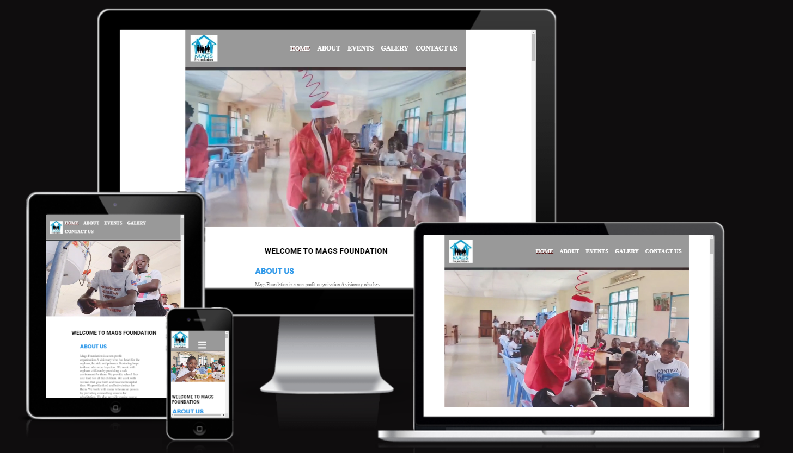

# Mags Foundation
[live project on Github](https://joelsita.github.io/project-one/)

## Project Description
Mags foundation is a non-profit charity that is based in RD Congo. The founder of the charity is my brother (Magloire). We lost our dad when we were younger, my bother decided to give some back in turn to those who are orphan. When we went back to congo we visted children's school and  minar prison, we saw how chriden were suffuring my brother decided to create a foundation to help. Mags foundation was created in 2018. head of operation is based in Dublin, Ireland. However all the actions and activities takes place in RD Congo. The purpose of this webisite is to make people aware of the existance of mags foundation and to get people in involved in our activities.

## Table of Contents
* [UXD (User Experience Design)](#user-experience-ux)
  * [User Stories](#user-stories) 

  http://www.responsinator.com/?url=https://joelsita.github.io/project-one/

## User Story

The reason behind this website is to raise awareness about mags foundation activies, so peoples can get involved.

Users can become a member or they can donate to help out with our annual event. They can simply do this by either contact us with email or phone, otherwise they can easily submit a form with their inquiries.

Features to note are users can easily get in touch, donate, and join the community through links on the website. 

## New User Stories

As a first-time user of the website to be able to: 

- This is a single page and I have added a smoth  scroll feature so users can easily navigate

- I have added background shadow on Home link to show the user that they are on the landing page. 
- Easily locate social media links.
- Use the website on mobile devices easily

# Features
## Navigation Bar
  - navbar is located at the top of the page. 
  - mags logo at the top left corner
  - navigation menu at top right corner

  

## Video
I have included children playing video to capture visitor's mind when they land to our page. this video shows an image of chidreen with a happy face.
- video was taken during our annual happy child event.

## Welcone message
This section is to welcome new & old user and thanks who visit our website.

## About us Section
This section provide about information about mags foundation. This outline your principle and goals. it provides great deatils of the services we operate.

## Galleries section
Here I have included some of the pictures that was captured during our annual events. Those images provide physical represention of the activies we run. I have added a hover affect when user hover a picture the sizes increases and has shadow

## News &Events 
In this section we have provided users with all the news & events that will take place throughout the year.

## Contact US
This section is divided in two halves. I have provided our contact details in case the users want to get in contact with us. 
I have also provide a form for users to submit their inquiries 

## footer
footer section contain our social media in case the visitor want to follow us.

# Testing:
## Features Testing
All th feaures of the website have been tested to make sure it working as designed.

<table>
  <thead>
    <tr>
      <th>Feature</th>
      <th>Test case</th>
      <th>outcome</th>
    </tr>
  </thead>
  <tbody>
    <tr>
      <td>About link</td>
      <td>click on about link</td>
      <td>This brings the user to about section</td>
    </tr>
    <tr>
      <td>Gallery link</td>
      <td>click on gallery link</td>
      <td>This brings the user to Gallery section/ pass</td>
    </tr>
    <tr>
      <td>Event link</td>
       <td>click on Event link</td>
      <td>This brings the user to Event section/ pass</td>
    </tr>
    <tr>
       <td>contact link</td>
       <td>click on Event link/ user tried to submit a form without filling all the required field</td>
      <td>This brings the user to Event section/user was prompt to fill the required field before submitting the form/ pass</td>
    </tr>
    <tr>
      <td>social media icon</td>
       <td>click on icon link</td>
      <td>this open new page and brings the user to our social media pages/ pass</td>
    </tr>
  </tbody>
</table>

## BrowserTesting
Website is tested acrossed below browsers to check performance
<table>
  <thead>
    <tr>
      <th>Tested browser</th>
      <th>Test Method</th>
      <th>Expected Outcome</th>
      <th>Test Result</th>
      <th>Notes</th>
    </tr>
  </thead>
  <tbody>
    <tr>
      <td>Navigation Bar</td>
      <td>Manual Testing on Browsers</td>
      <td>Links navigate correctly, responsive design</td>
      <td>Pass</td>
      <td>Tested on Chrome, Safari, Edge</td>
    </tr>
    <tr>
      <td>Hero Image</td>
      <td>Visual Inspection</td>
      <td>Image is clear, overlay text readable</td>
      <td>Pass</td>
      <td>Responsive on all device sizes</td>
    </tr>
    <tr>
      <td>About Section</td>
      <td>Device Testing, Visual Check</td>
      <td>Text is responsive and readable across devices</td>
      <td>Pass</td>
      <td>Consistent font and size</td>
    </tr>
    <tr>
      <td>Images Section</td>
      <td>Click-through Testing</td>
      <td>Images link to correct pages, hover effect works</td>
      <td>Pass</td>
      <td>Checked hover effect on desktop</td>
    </tr>
    <tr>
      <td>Information Section</td>
      <td>Content Verification</td>
      <td>Accurate and up-to-date information about condition</td>
      <td>Pass</td>
      <td>Cross-checked with medical resources</td>
    </tr>
    <tr>
      <td>Donate Section</td>
      <td>Functional Testing</td>
      <td>Donation button links to correct page</td>
      <td>Pass</td>
      <td>Tested button responsiveness on different devices</td>
    </tr>
    <tr>
      <td>Contact Us Section</td>
      <td>Form Submission Test</td>
      <td>Form submitted correctly, required fields validated</td>
      <td>Pass</td>
      <td>Tested form responsiveness and field requirements</td>
    </tr>
    <tr>
      <td>Footer</td>
      <td>Manual Testing</td>
      <td>Social media links work, layout is consistent</td>
      <td>Pass</td>
      <td>Social media links open in a new tab</td>
    </tr>
  </tbody>
</table>

### Reference

### Acknowledgements
I would like to thank my mentor Spence for the help and support. I would like to also thank my wife, family and friend for the incrediably support support they have showed me during this project by doing all the testing for me.