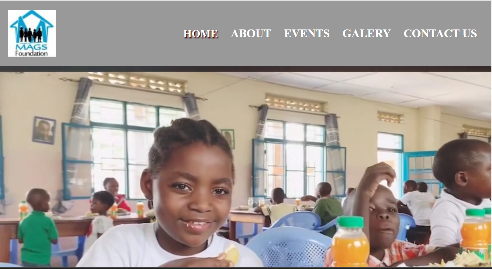
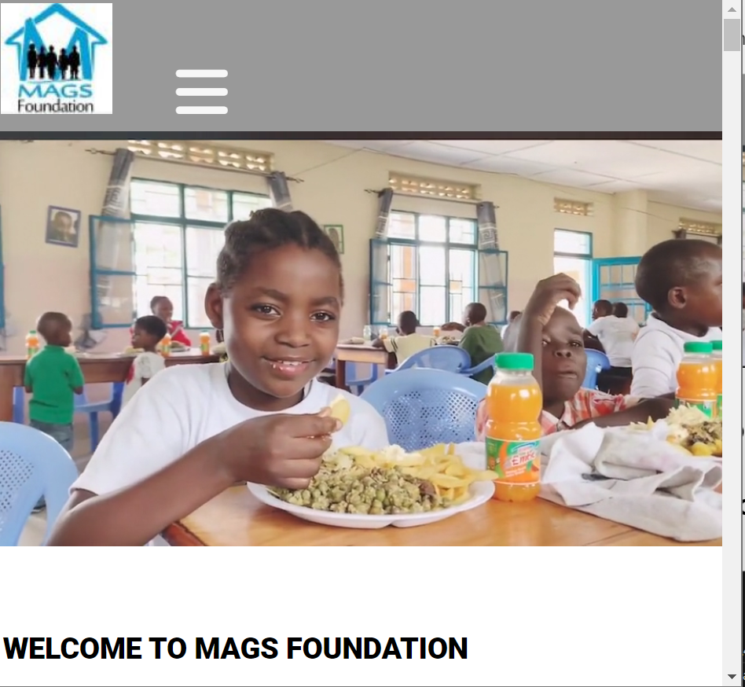

# Mags Foundation
[live project on Github](https://joelsita.github.io/project-one/)
##Project Description
Mags foundation is a non-profit charity that is based in RD Congo. The founder of the charity is my brother (Magloire). We lost our dad when we were younger, my bother decided to give some back in turn to those who are orphan. When we went back to congo we visted children's school and  minar prison, we saw how chriden were suffuring my brother decided to create a foundation to help. Mags foundation was created in 2018. head of operation is based in Dublin, Ireland. However all the actions and activities takes place in RD Congo. The purpose of this webisite is to make people aware of the existance of mags foundation and to get people in involved in our activities.

## Table of Contents
* [UXD (User Experience Design)](#user-experience-ux)
  * [User Stories](#user-stories) 

  http://www.responsinator.com/?url=https://joelsita.github.io/project-one/

### Reference

### Acknowledgements
I would like to thank my mentor Spence for the help and support. I would like to also thank my wife, family and friend for the incrediably support support they have showed me during this project by doing all the testing for me.