# Mags Foundation
[live project on Github](https://joelsita.github.io/project-one/)

## Project Description
Mags foundation is a non-profit charity that is based in RD Congo. The founder of the charity is my brother (Magloire). We lost our dad when we were younger, my bother decided to give some back in turn to those who are orphan. When we went back to Congo we visited children's school and  minor prison, we saw how children were suffering my brother decided to create a foundation to help. Mags foundation was created in 2018. head of operation is based in Dublin, Ireland. However all the actions and activities takes place in RD Congo. The purpose of this website is to make people aware of the existence of mags foundation and to get people in involved in our activities.

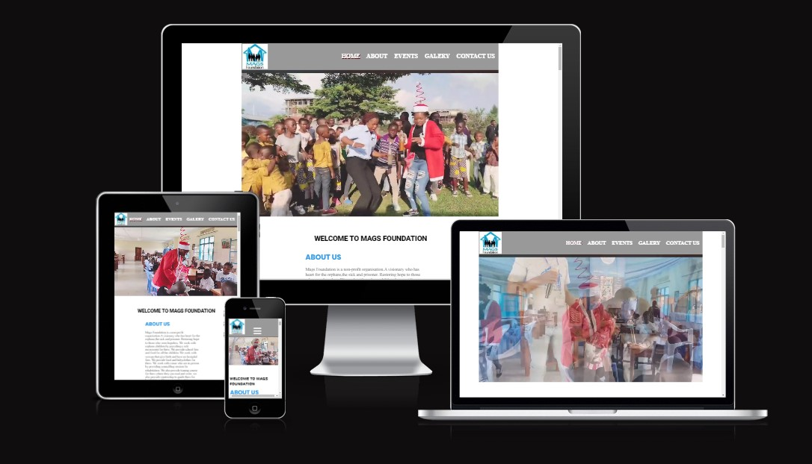

# Table of Contents
1. [UX](#user-experience-ux)
    - [User stories](#user-stories)
    - [New User](#new-user)
    - [Old User](#old-user)
2. [Design](#design) 
    - [Wireframes](#wireframes)
      - [Mobile](#mobile)
      - [Desktop](#desktop)
    - [ Colour Scheme](#colour-scheme)
    - [ Imagey](#imagery)
3. [Deployment](#deployment) 

# User experience (UX)
## User Stories

The reason behind this website is to raise awareness about mags foundation activies, so peoples can get involved.

Users can become a member or they can donate to help out with our annual event. They can simply do this by either contact us with email or phone, otherwise they can easily submit a form with their inquiries.

Features to note are users can easily get in touch, donate, and join the community through links on the website. 

### New User

As a first-time user of the website to be able to: 

- To nagivate through the website and find relevent sections easily.

- This website is a single page which makes it easy for new user to find important information.
- I want New user to get to know mags foundation in great details.
- new users should be about to find out about our current, past and futures activies.

- new users have the options to contact us directly or to submit a form.

### Old User
- I want old user to check out upcoming events and get involved. 

## Design
Website is consist of one page. easy to navigate and smooth transition to go through each sections.
## Wireframes
#### Mobile
 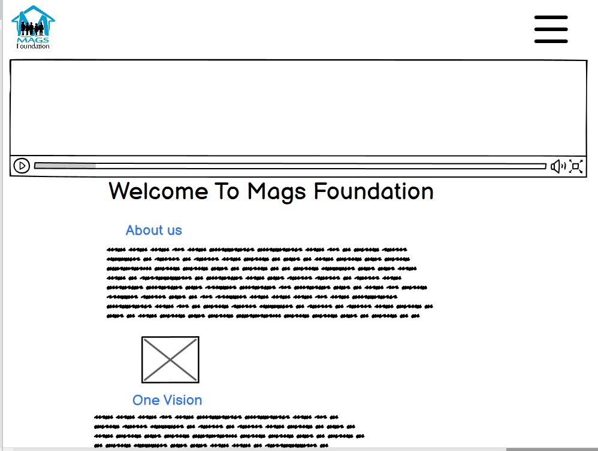
  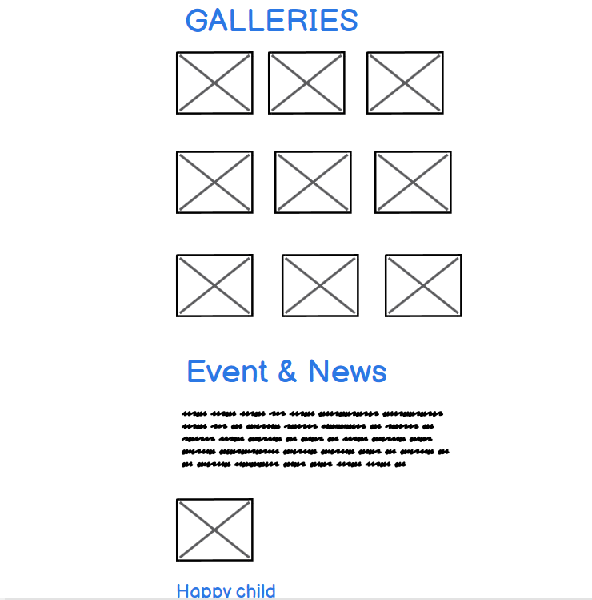
   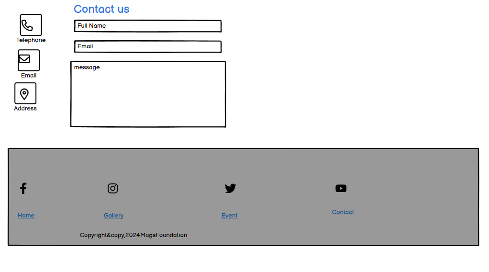

  #### Desktop
 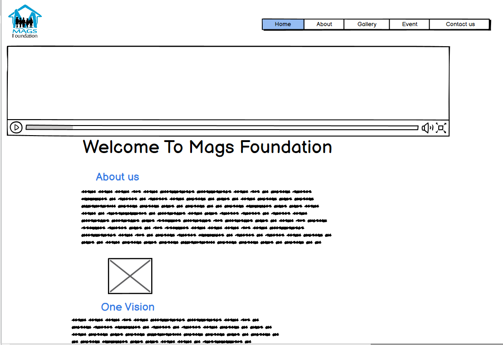

## Colour Scheme

## Imagery
- Images for this website was taken from mags foundation social media pages.

# Deployment
1. Go to the Settings tab of your GitHub repo.
2. On the left-hand sidebar, in the Code and automation section, select Pages.
3. Make sure:
Source is set to 'Deploy from Branch'.
Main branch is selected.
Folder is set to / (root).
4. Under Branch, click Save.
5. Go back to the Code tab. Wait a few minutes for the build to finish and refresh your repo.
6. On the right-hand side, in the Environments section, click on 'Github-pages'.

# Features
## Navigation Bar
  - navbar is located at the top of the page. 
  - mags logo at the top left corner
  - navigation menu at top right corner

  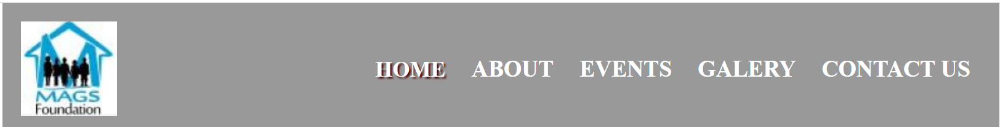

## Video
I have included children playing video to capture visitor's mind when they land to our page. this video shows an image of chidreen with a happy face.
- video was taken during our annual happy child event.
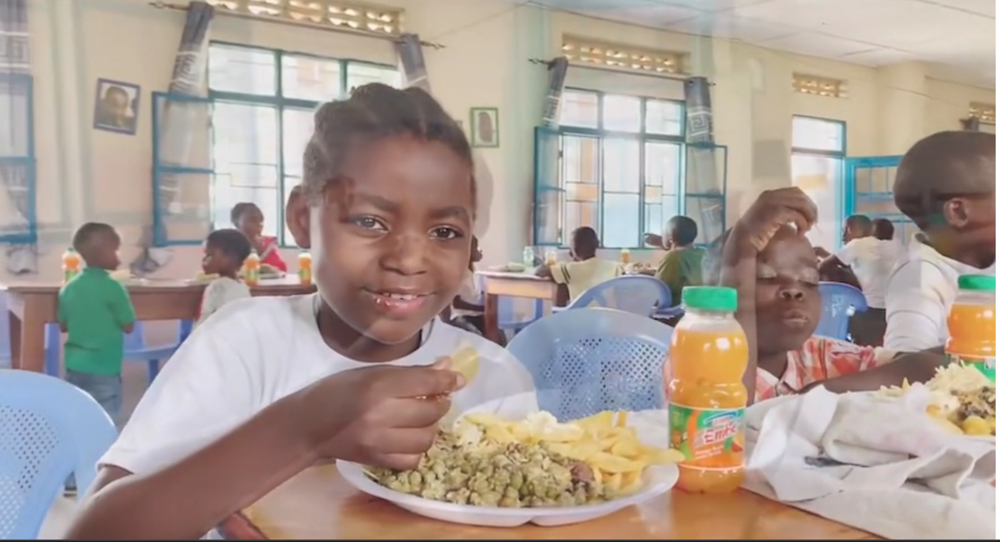

## Welcone message
This section is to welcome new & old user and thanks who visit our website.

## About us Section
This section provide about information about mags foundation. This outline your principle and goals. it provides great deatils of the services we operate.
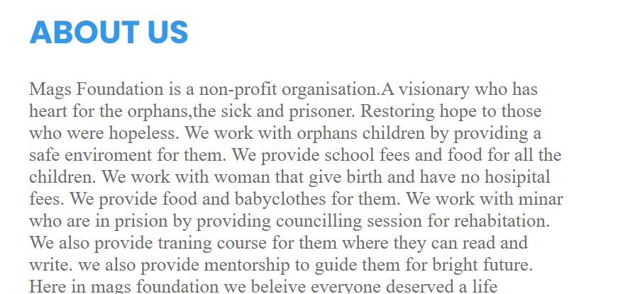

## Galleries section
Here I have included some of the pictures that was captured during our annual events. Those images provide physical represention of the activies we run. I have added a hover affect when user hover a picture the sizes increases and has shadow
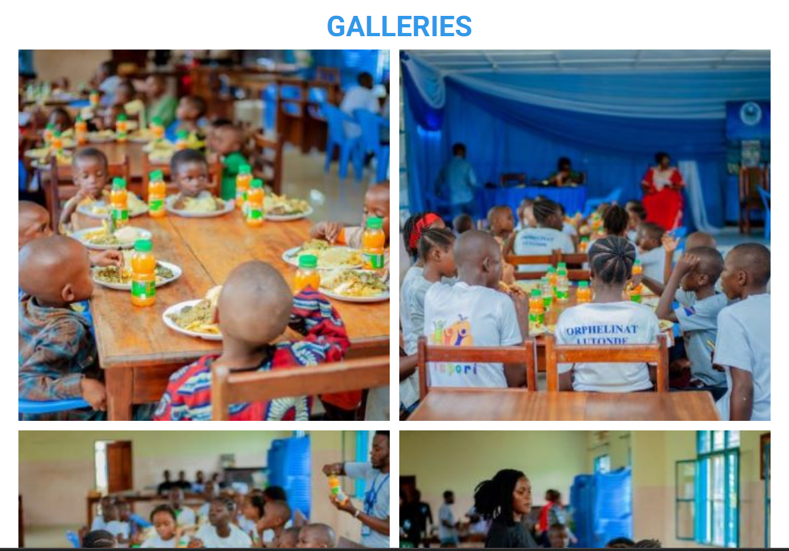

## News &Events 
In this section we have provided users with all the news & events that will take place throughout the year.

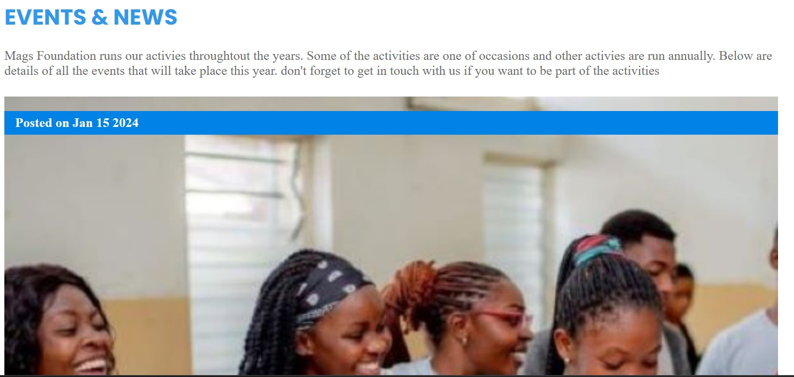
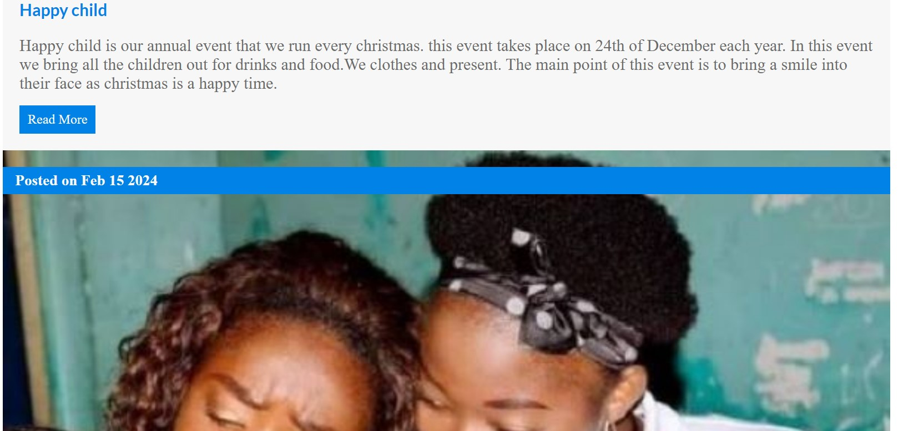

## Contact US
This section is divided in two halves. I have provided our contact details in case the users want to get in contact with us. 
I have also provide a form for users to submit their inquiries 
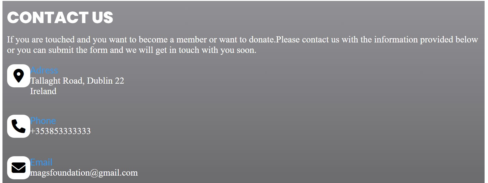
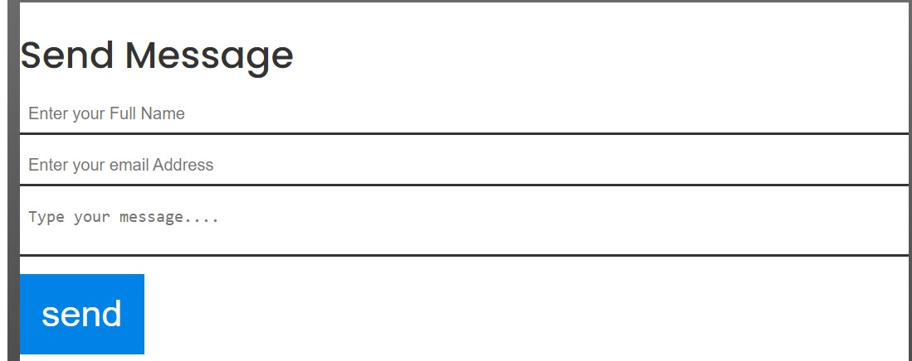

## footer
footer section contain our social media in case the visitor want to follow us.
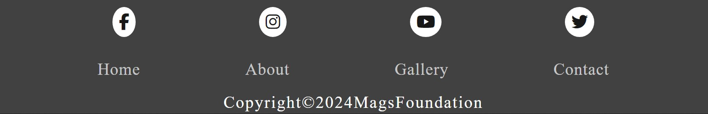

# Testing:
## Features Testing
All th feaures of the website have been tested to make sure it working as designed.

<table>
  <thead>
    <tr>
      <th>Feature</th>
      <th>Test case</th>
      <th>outcome</th>
    </tr>
  </thead>
  <tbody>
    <tr>
      <td>Navbar| About</td>
      <td>click on about link</td>
      <td>This brings the user to about section</td>
    </tr>
    <tr>
      <td>Navbar| Gallery</td>
      <td>click on gallery link</td>
      <td>This brings the user to Gallery section/ pass</td>
    </tr>
    <tr>
      <td>Navbar| Event</td>
       <td>click on Event link</td>
      <td>This brings the user to Event section/ pass/ all the text is readble/font and size  is good.</td>
    </tr>
    <tr>
       <td>Navbar| Contact</td>
       <td>click on Contact link/ this brings the user to contact section. user tried to submit a form without filling all the required fields</td>
      <td>This brings the user to Event section/user was prompt to fill the required field before submitting the form/ pass</td>
    </tr>
    <tr>
      <td>social media icon</td>
       <td>click on icon link</td>
      <td>this open new page and brings the user to our social media pages/ pass</td>
    </tr>
  </tbody>
</table>

## Browser Testing
Website is tested acrossed below browsers to check performance
<table>
  <thead>
    <tr>
      <th>Tested browser</th>
      <th>Appearance</th>
      <th>Responsiveness</th>
    </tr>
  </thead>
  <tbody>
    <tr>
      <td>Chrome</td>
      <td>All the links, form, button appears good</td>
      <td>responsive design/ Good</td>
    </tr>
    <tr>
       <td>Edge</td>
      <td>All the links, form, button appears good</td>
      <td>responsive design / Good</td>
    </tr>
    <tr>
      <td>Firefox</td>
      <td>All the links, form, button appears good</td>
      <td>responsive design/ Good</td>
    </tr>
 
  </tbody>
</table>

##  Responsiveness
Website is tested acrossed below browsers to check performance
<table>
  <thead>
    <tr>
      <th>Tested device</th>
      <th>Appearance</th>
      <th>Responsiveness</th>
    </tr>
  </thead>
  <tbody>
    <tr>
      <td>Chrome</td>
      <td>All the links, form, button appears good</td>
      <td>responsive design/ Good</td>
    </tr>
    <tr>
       <td>Edge</td>
      <td>All the links, form, button appears good</td>
      <td>responsive design / Good</td>
    </tr>
    <tr>
      <td>Firefox</td>
      <td>All the links, form, button appears good</td>
      <td>responsive design/ Good</td>
    </tr>
 
  </tbody>
</table>

##Responsive testing
<table>
  <thead>
    <tr>
      <th>Tested Device</th>
      <th>Site responsive  min-width: 600px</th>
       <th>Site responsive min-width: 768px</th>
        <th>Site responsive min-width: 992px600px</th>
    </tr>
  </thead>
  <tbody>
    <tr>
      <td>Phone 14 pro</td>
      <td>Good/ nav Links are hiden. Menu icon display</td>
      <td>N/A</td>
      <td>N/A</td>
    </tr>
    <tr>
       <td>ipad tablet</td>
      <td>N/A</td>
      <td>Good/ nav Links are displayed</td>
      <td>N/A</td>
    </tr>
    <tr>
       <td>nest hub larger screen</td>
      <td>N/A</td>
      <td>N/A</td>
      <td>Good/ nav Links are displayed</td>
    </tr>
 
  </tbody>
</table>

# Code Validation:
## HTML Validation
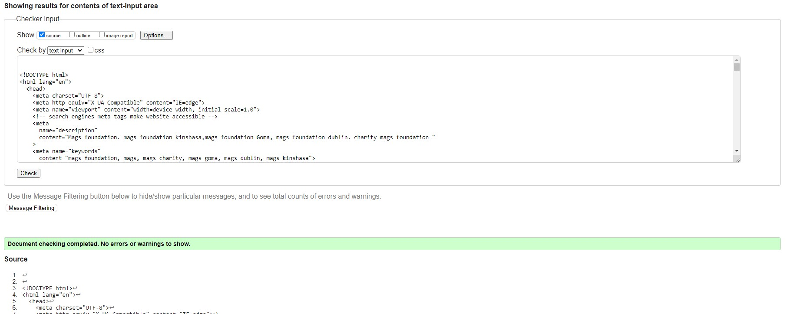

## CSS Validation
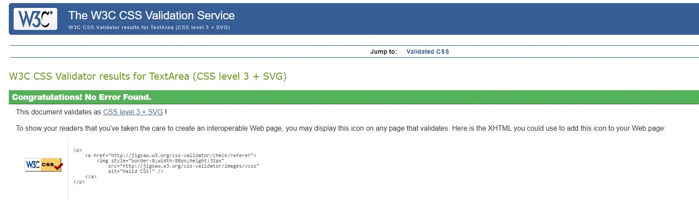

## Lighthouse Test
### performance 
* was less than 90%. I reduced image width to 600px and this improves the overall preformance and accessibility. 

## Libraries and Programs:
- Used Visual Studio Code  as editor.
- Used Font Awesome for the social media icons.
- Used GitHub as version control to add, commit and push to repository
- Used Google fonts to traget elements font style.
- Used balsamiq for wireframes
- Google Chrome 
- Firefox (For testing purpose)
- MS Edge (For testing purpose)

# Technologies Used
## Languages
languages used: HTML(page structures) and CSS3(styling of the page).

## Bugs
* Once you switch to mobile version, click menu icon the dropdown displayed. This is remaing on a larger screen.

### solution 
I included min-width: 768px
 #check:checked ~ ul li {
    display: inline-block;
    border: none;
  } in media query 

* At min-width: 768px padding was 24px as result contact-us link is showing out of place. 
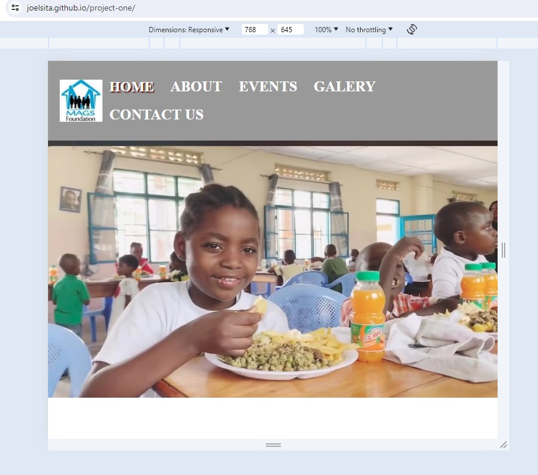
###solution
Removed padding
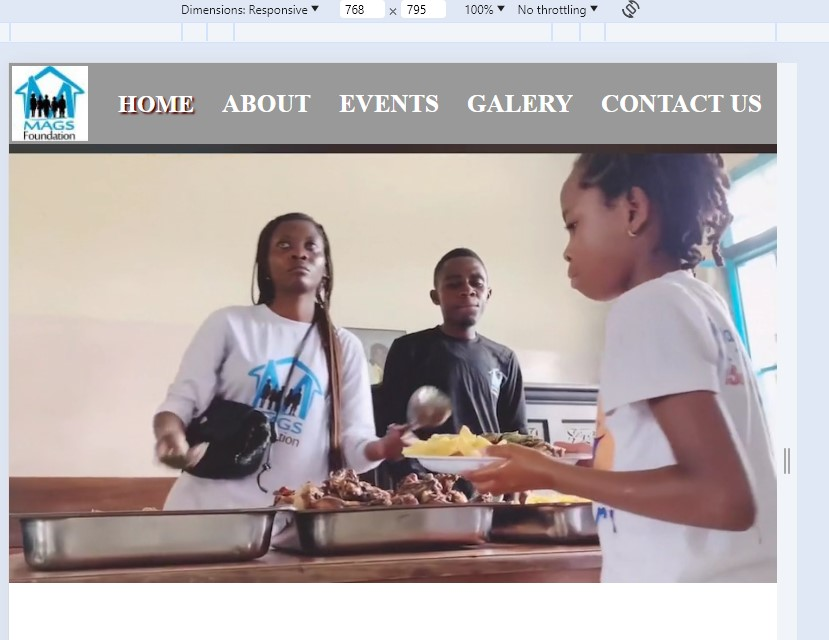

* page width scratching making page's contect displaying out of place.

### Solution
added a container 
.container {
  max-width: 1080px;
  width:100%;
  margin: 0 auto;
}

# Credits
## Code Used
- Toggle feature was taken from Ci project "love Running"
- Used <a href="https://www.w3schools.com/" target="_blank"> W3Schools </a> to implement some sections of my website.
- I watched video <a href="https://www.youtube.com/watch?v=Jq_Zebxa-YI&ab_channel=EasyCode" target="_blank">here </a> on how to add background video.

- I watched video <a href="https://www.youtube.com/watch?v=Trw_9lisYVY&ab_channel=Tech2etc" target="_blank">here </a> on how to make responsive gallary.

## Media
- All videos and pictures are from <a href="https://www.facebook.com/magloire.ndongo1" target="_blank">Mags foundation </a>

## Acknowledgements
I would like to thank my mentor Spence for the help and support. I would like to also thank my wife, family and friend for the incredible support they have showed me during this project by doing all the testing for me.

[Return to top](#project-description)